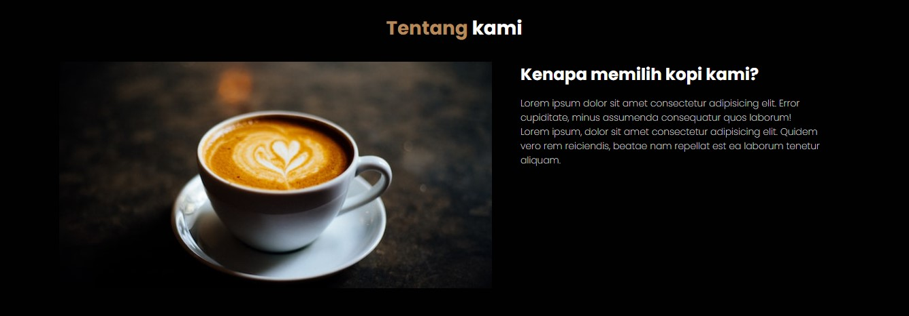

    

# Bellshade Squad (HTML+CSS)

> _"Hey Squad!!.. Waktunya untuk bergerak bersama mengerjakan sebuah project yang luar biasa"_ ✨.

Bellshade Squad adalah sebuah template repository yang dapat kamu gunakan untuk belajar kolaborasi bersama teman satu tim menggunakan Git dan GitHub. Squad repository ini berisi skeleton atau rangka dari sebuah project kecil yang dapat dikerjakan bersama-sama secara paralel. Bellshade squad memberikan beberapa task yang dapat ditugaskan ke anggota tim untuk membentuk satu project jadi hasil kerja sama tim. Jadi kamu bebas untuk berkolaborasi dengan cara apapun yang kalian suka ✨.

## Tentang template ini / <small><i>About this template</i></small>

Template kali ini berisi project kolaborasi tentang _**HTML+CSS+JS**_. Agar lebih mudah kami bakal menggunakan project Kedai Kopi WPU dari tutorial yang sudah dibuat Padhika sebagai project yang akan kalian kerjakan pada collaborative squad kali ini bersama teman kalian sebagai satu tim yang solid.

> Link tutorial kedai kopi HTML+CSS+JS 
> 👉 [Membuat WEBSITE Kedai Kopi RESPONSIVE dengan HTML & CSS dari 0 ](https://www.youtube.com/watch?v=MCVkMmYL-aY)

### Goals

Di project ini kalian harus menyelesaikan project web yang sama dengan padhika buat pada tutorial diatas. Semua anggota tim yang kalian pilih harus berkolaborasi setidaknya pada satu task.

Kami bagi menjadi 6 task untuk menyelesaikan project ini, kamu dan anggota timmu dapat membagi tugas-tugas ini.

    
<strong>Lihat task</strong>

1. **Navbar** _([issue](https://github.com/bellshade/squad-frontend-1/issues/1))_

Navbar disini meliputi:

-   navbar brand (logo)
-   navbar link
-   navbar icon (termasuk toggler)
-   mobile responsive navbar

    

jangan lupa tentang responsitivity, di layar mobile harus tampak seperti berikut
 
 

    

2. **Jumbotron** _([issue](https://github.com/bellshade/squad-frontend-1/issues/3))_

Jumbotron adalah bagian banner besar yang menjadi titik fokus utama pengguna saat sekilas memandang halaman web. Section hero jumbotron meliputi:

-   Background image besar menggunakan ./img/header-bg.jpg
-   Sejumlah title text, dan
-   CTA (click to action)
-   polesan sedikit gradient black to transparent keatas di daerah paling bawah jumbotron untuk menunjukkan kesan dark moody coffee

    

3. **About Section** _([issue](https://github.com/bellshade/squad-frontend-1/issues/5))_

Task ini berisi section tentang apapun berkaitan dengan about us. kurang lebih seperti ini. Jangan lupakan untuk menerapkan responsive mobile.

    

4. **Menu Section** _([issue](https://github.com/bellshade/squad-frontend-1/issues/7))_

Menu section berisi daftar menu minuman kopi yang tersedia, digambarkan dalam card yang berjajar berisi gambar, nama minuman dan harganya. Jangan lupakan untuk menerapkan responsive mobile juga!.

    

5. **Kontak Kami** _([issue](https://github.com/bellshade/squad-frontend-1/issues/9))_
   Contact section adalah bagian yang menggambarkan kontak dari yang menyediakan kopi ini. Contact terdiri atas:

-   Maps
-   Static Form (nama, email dan no. hp)

    

6. **Footer** _([issue](https://github.com/bellshade/squad-frontend-1/issues/10))_
   Footer berisi

-   link scrollspy seperti navbar
-   social link
-   credits

    

 

### Peraturan dan saran

Ada beberapa peraturan yang bisa kalian terapkan untuk integritas pengerjaan project yang lebih baik:

1. Setiap anggota tim wajib mengerjakan setidaknya satu task
2. Setiap task yang dikerjakan, harus dikerjakan di branch tersendiri.  Submit PR saat sudah selesai mengerjakan untuk mendapatkan persetujuan dari anggota lain.
3. Ketika ada pengajuan PR, tim lain berhak untuk mengkoreksi dengan mereview kode dan mengajukan perubahan _(request changes)_. Si pembuat PR wajib merespon koreksi dari tim lain itu.

Dan berikut saran yang bisa kami berikan:

1. Tunjuk satu dari anggota untuk menjadi team leader yang bertugas untuk menjaga keberlangsungan kerja tim.
2. Gunakan project management software seperti trello, jira, clickup atau bahkan github juga punya namanya Github Project.
3. Terapkan metode manajemen disiplin yang populer seperti Agile Scrum, waterfall dll. 

> kalian berkesempatan untuk belajar metodologi pengembangan perangkat lunak dengan mini project tim ini. Manfaatkan dengan baik!.

 

## Getting Started
